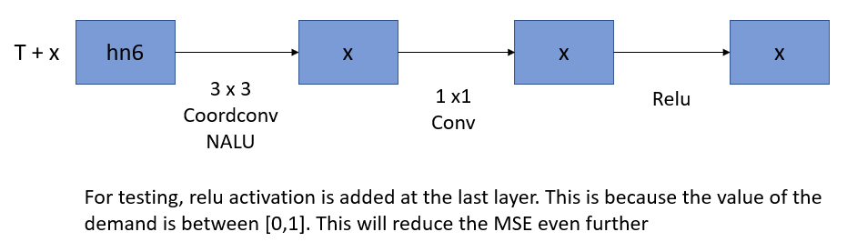
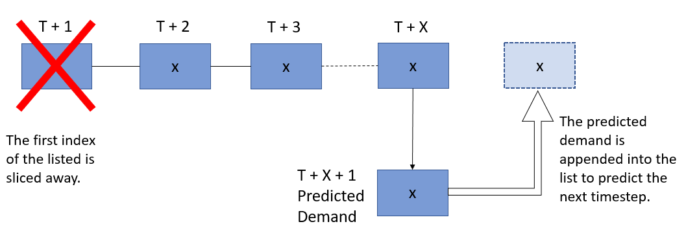

# Predicting demand for traffic management

## Requirements
1. python 2.7/3.5
2. pytorch 1.1
3. numpy
4. Geohash
5. pandas

## Equipment used

1. Ubuntu LTS 16.04

2. Google colab (GPU K80)
> To train in colab, run the script inside the colab files

## Procedure

1. Go to the storage file and run the script to proccess the data.

2. Train the model
```python
python train.py
```

3. Test the model
```python
python test.py
```
> The output of the test is the image of the demand for the next timestep.

## Test the model on a new dataset

1. Go to storage and copy the new dataset csv file inside that folder.

2. Open the data.py file

3. 
```python
df=pd.read_csv(filepath_or_buffer = "training.csv")
```
Change **training.csv** to the filename of the csv you just transfered.

4. 
```python
with open("traffic_image.txt", "wb") as fp:
```
Change **traffic_image.txt** to a new filename. It can be any name. (Eg. **test_set.txt**)

5.  Go back to the main directory, and open up preprocessing_testset.py file.

6. 
```python
with open("./storage/traffic_image.txt", "rb") as fp
```
Change **./storage/traffic_image.txt** to the new filename you just rename. (Eg. **./storage/test_set.txt**)

7. 
```python
python testset.py
```
Run testset.py to see the predicted demand of the next few timestep.

8. 
```python
epochs=5
```
The next_demand that is printed on the screen is the predicted demand of the next timestep. To change the number of timestep to be predicted, change the value **5**.

## Model architecture


#### Training

The model is trained using 18 sequential timestep in this model. This value can be changed and fine-tune to reduce the loss.

Last 2 layers,


#### Testing

Last 2 layers,


To predict the demand for the next few timestep, this is process is iterated.



