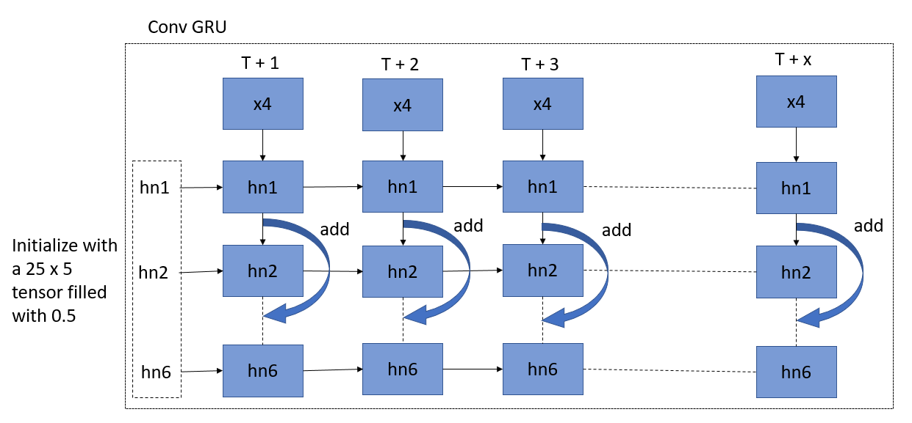

#Predicting demand for traffic management

## Requirements
1. python 2.7/3.5
2. pytorch 1.1
3. numpy
4. Geohash
5. pandas


## Equipment used
1. google colab (GPU K80)
> To train in colab, run the script inside the colab files

2. Ubuntu LTS 16.04

## Procedure

1. Go to the storage file and run the script to proccess the data.

2. Train the model
```python
python train.py
```

3. Test the model
```python
python test.py
```
> The output of the test is the image of the demand for the next timestep.

##Model architecture





